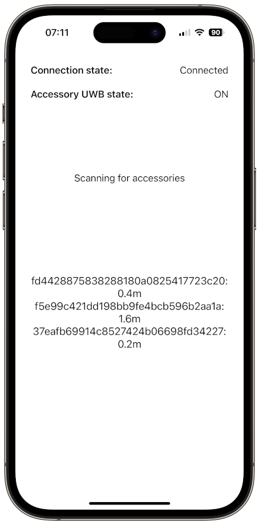
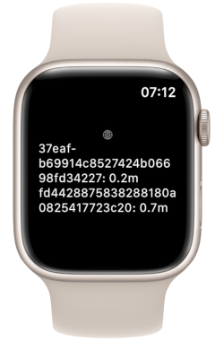

# OpenUWB

This Swift package implements convenience functionality to use Estimote UWB beacons with Apple's Nearby Interactions framework.

The code is based on the sample project from the WWDC21 session [10165: Explore Nearby Interaction with Third-Party Accessories](https://developer.apple.com/wwdc21/10165).

## Demo

A demo app is available at [gunnarbeutner/OpenUWBDemo](https://github.com/gunnarbeutner/OpenUWBDemo). It supports both iOS and watchOS:

    
    

Set the run destination to an iPhone that contains a U1 chip. The sample app interacts with an accessory you partner with or develop using the [Ultra Wideband (UWB) third-party device specification](https://developer.apple.com/nearby-interaction).
